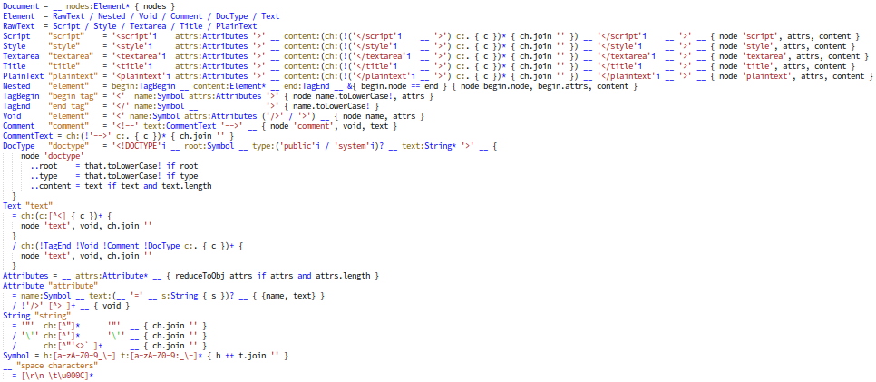

# PEG HTML parser

[![Build and Test][ga-badge]][ga-url]
[][license]

This is definitely not the fastest HTML/XML parser that runs on JavaScript but is very small and simple, just so it can be easily modified.

The purpose of this project is to be a quick start for playing with [PEG.js][peg-js] and especially for those who love [LiveScript][livescript].

If you want to know more about PEGs syntax and flavors here are the fun staff - [_Parsing expression grammars_][peg-bford].

The whole [PEG HTML parser](./src/peg-html-parser.pegls) squeezed without comments and empty lines. It is really a collection of grammar rules from which PEG.js can generate JS parser.
My inspiration for writing HTML grammar rules was of course [W3C HTML5][w3c-html5] syntax recommendation.



## Installation

Checkout the repo and install `node` dependencies.

```sh
npm i
```

Optionally, for syntax highlighting in Sublime Text editor, you can install [PEGjs LiveScript][pegjs-sublime] plugin.

## Usage

### Watch

On every save of the parser `./src/peg-html-parser.pegls` all `*.html` files from `./test/fixtures` will be parsed and the result of parsing and AST will be written in `./.watch` folder in YAML format.

```sh
npm run watch
```

### Build

Generates the JS parser to `./dist` folder (only CommonJS module style).

```sh
npm run build
```

## Tests

Executes tests and parses all `*.html` files from `./test/fixtures`.

```sh
npm test
```

## License

[The MIT License (MIT)][license]

[peg-js]: https://github.com/pegjs/pegjs
[peg-bford]: http://bford.info/packrat
[livescript]: https://github.com/gkz/LiveScript
[pegjs-sublime]: https://packagecontrol.io/packages/PEGjs%20LiveScript
[w3c-html5]: https://www.w3.org/TR/html5/syntax.html
[ga-badge]: https://github.com/tgrospic/peg-html-parser/actions/workflows/node.yml/badge.svg?branch=master
[ga-url]: https://github.com/tgrospic/peg-html-parser/actions?query=branch:master
[license]: https://github.com/tgrospic/peg-html-parser/blob/master/LICENSE
